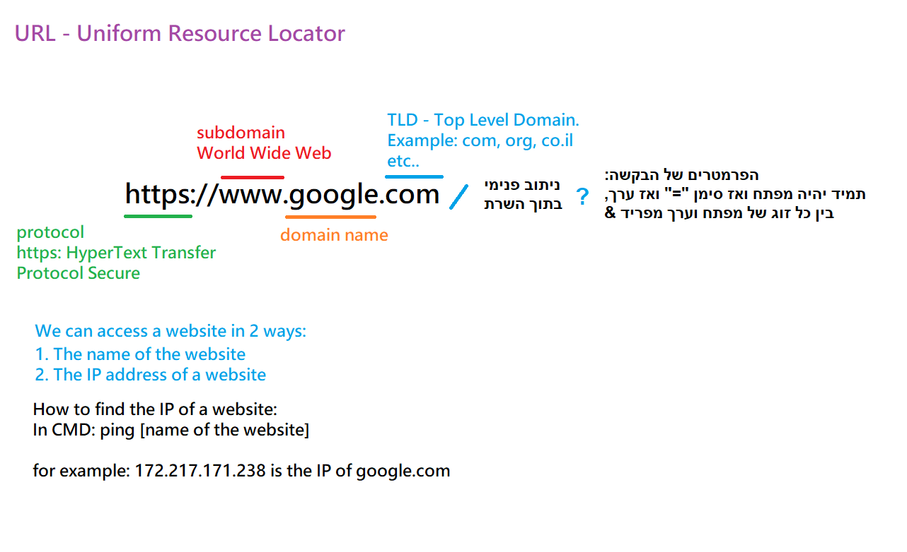

# Lesson 04

Full explanation about URL structure:


### Button - כפתור
* Note: we cannot use button tag without JavaScript. 
```html
<button></button>
```

### Input - קלט מהמשתמש
Input element can get many types of input from the user. 
for example: number, color, file, image, text, email, etc..
```html
<input type="" />
```

##### Placeholder attribute
Placeholder attribute is the background of the input field. (in grey). 
```html
placeholder=""
```

##### Min and max attributes
min and max attributes are used for input type=range, to define the minimum and maximum range. 
```html
min="" max=""
```
##### name attribute
the name attribute points to the query in the website. 
example:
```html
name="q"
```

### Form 
The form element represents a collection of input elements

```html
<form></form>
```

### Select
The select tag used to create a drop-down of many options. The user can select one option. 
```html
<select>

    <option></option>
    <option></option>
    <option></option>
    <option></option>

</select>
```
