# Lesson 10

## Tables:

1. `<table class="table"></table>`

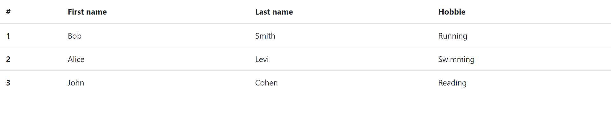

2. `<table class="table table-dark"></table>`

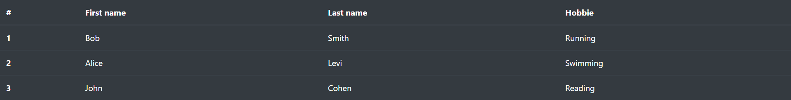

3. `<thead class="thead-dark"></thead>`

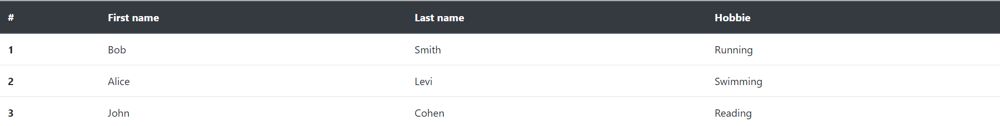

4. `<thead class="thead-light"></thead>`

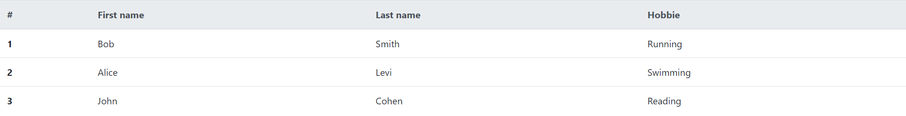

5. `<table class="table table-striped"></table>`
   `<thead class="thead-dark"></thead>`

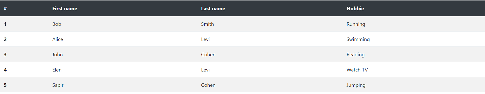

6. `<table class="table table-striped table-dark"></table> <thead class="thead-dark"></thead>`

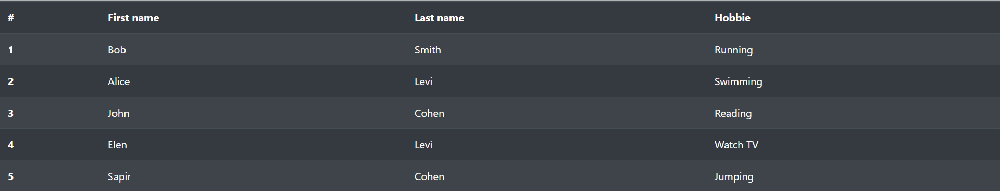

7. Bordered table: `<table class="table table-bordered"></table>`

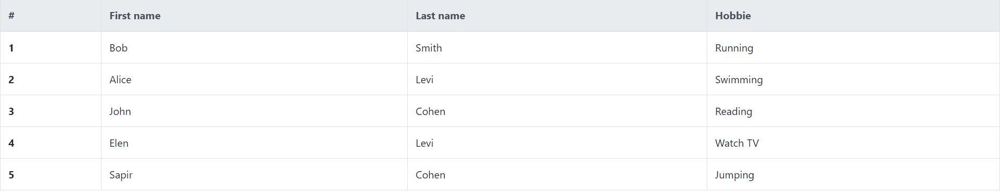

8. Bordered table: `<table class="table table-bordered table-dark"></table>`

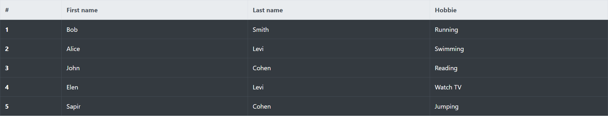

9. Borderless: `<table class="table table-borderedless"></table>`

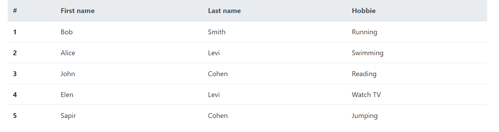

10. Small table: `<table class="table table-sm"></table>`

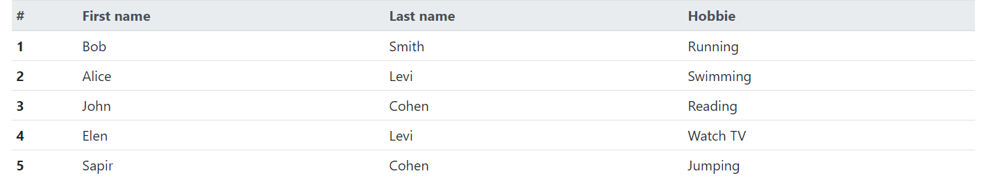

11. Contextuall class: use `class="table-color"`. can be used both for tr, and td.

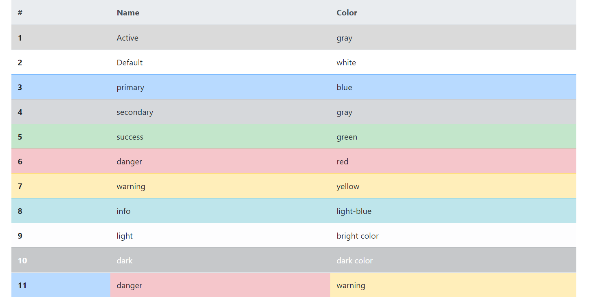

12. Background color: `<tr class="bg-color"></tr>`. can be used both for tr, and td.

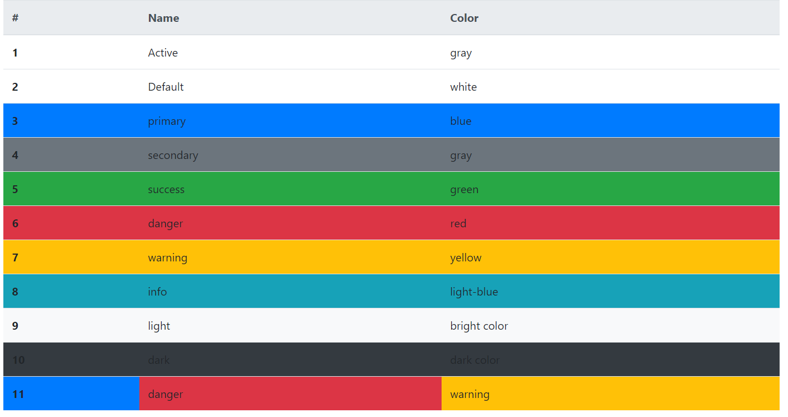

13. Caption

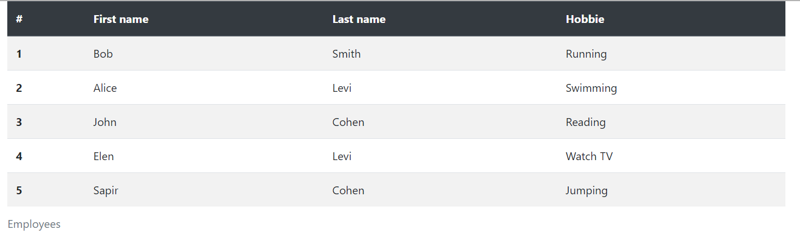
