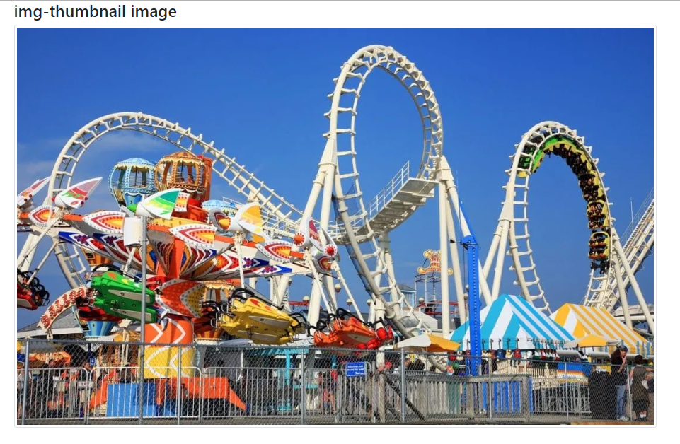

# Images

1. Rounded corners: `class="rounded"`

2. Circle: `class="rounded-circle"`

3. Thumbnail : `class="img-thumbnail"`

4. Img align - right and left: `class="float-left"` or `class="float-right"`

5. Center align: `class="mx-auto d-block"` (mx - margin auto, d - display)

